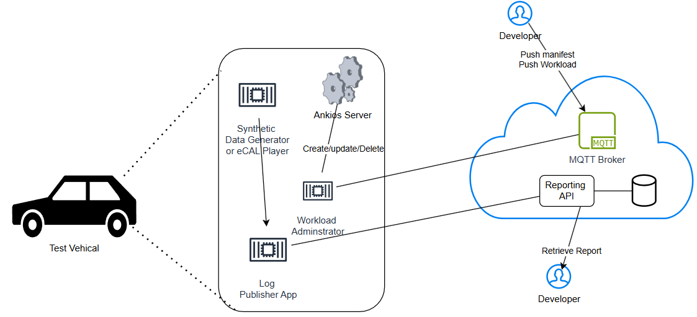

# Auto Guard

This repository provides solution that enable the software devleoper and tester for SDV to identify bugs/issues and deploy updated software in the Vehicle.
the following Eclipse SDV projects:
* [Ankaios](https://eclipse-ankaios.github.io/ankaios/latest/) - an embedded container and workload orchestrator targeted at automotive HPCs
* [eCAL](https://ecal.io/) – a fast communication middleware following the pub-sub principle
* [Ankaios Dashboard](https://github.com/FelixMoelders/ankaios-dashboard) – a graphical user interface for the Ankaios orchestrator

The repository additionally uses the MQtt Broker service provided by:
* [HiveMQ](https://www.hivemq.com/) - MQTT Broker service built for flexibility, security, and scalability

## Links

- [Ankaios docs](https://eclipse-ankaios.github.io/ankaios/0.5/)
- [Ankaios Dashboard](https://github.com/FelixMoelders/ankaios-dashboard)
- [Ankaios quickstart](https://eclipse-ankaios.github.io/ankaios/0.5/usage/quickstart/)
- [eCAL docs](https://eclipse-ecal.github.io/ecal/)
- [Podman](https://docs.podman.io/en/v4.9.3/)
- [What are devcontainers?](https://containers.dev/)

# Description
This product enables SDV vehicle into connected car to detect user defined event and abnormal values produced by Sofware and deploy the software update via CI/CD.
The example solution demonstrates the custom defined Emergency breaking event detection and immediately to the reporting system. The developer of the software retrieve
the report with attached vehicle Data. It is expected that developer will analyze the report and fix the issues and bugs in the software.

## Architecture

The repository contains the following Ankios workload:
- Log Publisher App
- Administrator workload

### Administrator workload

The administrator workload runs connects to the MQtt message broker service hosted in the Cloud to recieve the deployment notification Workload. It communicates with the Ankios server to perform the following actions:
- create workload
- update workload
- delete workload
- start workload
- stop workload

### Log Publisher App
This is an example workload which is available in the repository. The log publisher app is subscribe topic `eCAL measurment` to revieve the sensor data related to 
vehical dynamics to detect Emergency breaking event and communicate with Reporting API to POST vehilce sensor.
